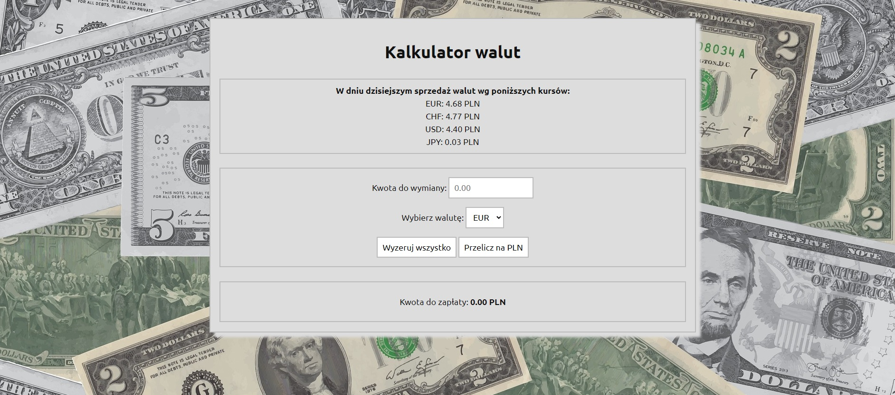

# Currency Converter

## Description

A simple currency converter as continuation of learning HTML, CSS and JavaScript. 
The code includes: the form with a choice of options, normalize.css and the BEM convention. 
In JavaScript code I used **arrow functions**.

## How it's working

This currency converter converts PLN currency to others, like EUR, CHF, USD and JPY, according
to given exchange rates.

## Warning

**The exchange rates used in the tool are exemplary. The calculator is for practice only**.

## Screenshots

**Screenshot 1:** default apperance, no data entered

**Screenshot 2:** entered data and displayed result

## Update 2025-01-07

Updated the content of the page, refactored HTML and CSS code.
Checked the JavaScript code and tested the functionality.

## Demo

<https://piotr-rulewicz.github.io/currency-converter/>